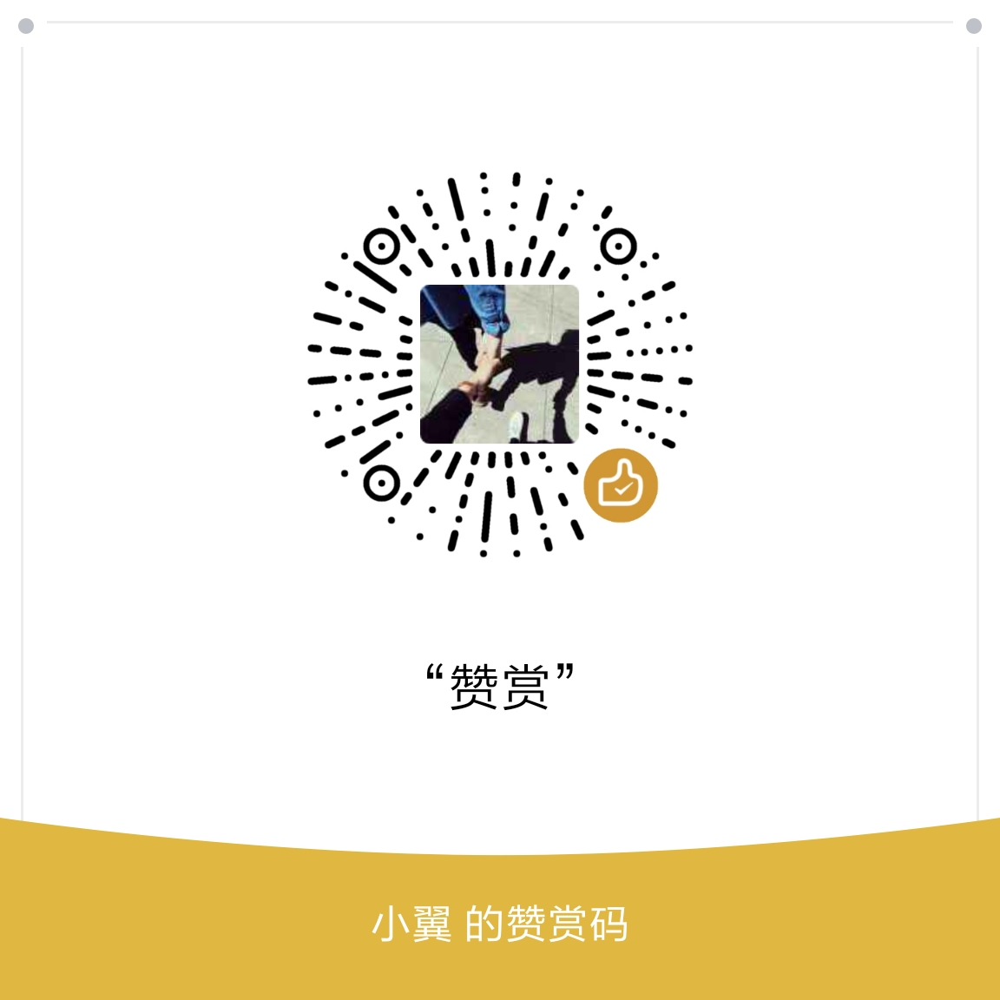

# React 手稿

该文档记录了本人在开发React时积累的各个知识点和一些常用的方法。

众所周知，React版本在不断的更新中，该文档只介绍React 16.3.0 ~ 16.6.0版本的内容。

该方法记录了React最佳的实践组合 react + redux-saga + react-router。

我们也会在文档中提到目前最好用的view组件 antd。

该文档可为正在学习React、从服务端转前端、正在使用React，但仅限于API调用者的朋友们参考。

## 前提

  假设对javaScript CSS HTML有一定的了解。
  
  并且对babel也有一定的了解。

  对webpack、node、npm(yarn)等也有一些了解。

