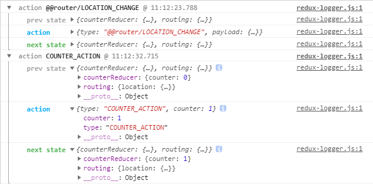

# React-Redux

## Redux

  * Action
    ```js
    function addTodo(text) {
      return {
        type: ADD_TODO,
        text
      }
    }
    ```
    `type` 属性是必须的。

  * Reducer
    ```js
    function todoApp(state = initialState, action) {
      switch (action.type) {
        case ADD_TODO:
          return Object.assign({}, state, {
            todo: action.todo
          })
        default:
          return state
      }
    }
    ```
    1、需要一个`case`与`action`的`type`一致。

    2、必须在`switch`的`defautl`返回原`state`。

  * Store
    
    * 管理整个应用的 `state`

    * 提供`getState()`方法，可以获取`state`

    * 通过`dispatch(action)`设置`state`

    * 提供`subscribe(listener)`注册和取消注册监听事件

## React-Redux

  > 是Redux的React实现,可参考 [Official React bindings for Redux](https://redux.js.org/basics/usagewithreact).

### 安装

  ```
  yarn add redux react-redux

  //or

  npm i redux react-redxu
  ```

### 组件层级划分

  * 表现性组件

    只负责显示UI的组件。

    例如：
    ```js
    <div></div>
    ```

  * 容器性组件

    不处理UI的组件，也不处理数据，只为UI组件提供数据的组件。

    例如：
    ```js
    connect(state => state)(<YourComponent />)
    ```
  
  * 其他组件

    除以上两种组件以外的组件。

### 使用Redux

我们以一个计数器的例子来说明如何使用React-redux.

  * 设计表现性组件

    需要：显示当前计数，默认为0；累加按钮，每次单击加1；递减按钮，每次单击减1；重置按钮，单击将计数设置为0。
    ```js
    import React from 'react';

    export default ({counter = 0}) => {

      const styles = {
        display: 'flex',
        justifyContent: 'space-around'
      };

      return (
        <div>
          <h1>当前计数为：{counter}</h1>
          <div style={styles}>
            <button>加</button> <button>减</button> <button>重置</button>
          </div>
        </div>
      );
    };
    ```
  * 设置容器性组件

    目的是将表现性组件中的数据抽离出去交给redux管理，然后通过容器性组件将redxu与表现性组件关联起来。

    ```js
    import { connect } from 'react-redux';
    import CounterIndex from '../components/chapter03/Counter';

    export default
      connect(state => ({ ...state.counterRedux }))(({ counter, dispatch }) => <CounterIndex counter={counter} dispatch={dispatch} />);
    ```

    * Action

    ```js
    export const COUNTER_ACTION = 'COUNTER_ACTION';

    export const addActioner = ({counter}) => {
      return {type: COUNTER_ACTION, counter: counter + 1};
    };

    export const subActioner = ({counter}) => {
      return {type: COUNTER_ACTION, counter: counter - 1};
    };

    export const resetActioner = () => {
      return {type: COUNTER_ACTION, counter: 0};
    };
    ```

    * Reducer

    ```js
    import { COUNTER_ACTION } from '../actions/CounterAction';

    export default (state, action) => {
      switch (action.type) {
        case COUNTER_ACTION:
          return { ...state, counter: action.counter };
        default:
          return state;
      }
    }
    ```

    * Store 
    ```js
    import React from 'react';
    import { Provider } from 'react-redux';
    import { createStore } from 'redux';
    import CounterReducer from '../reducers/CounterReducer';

    let store = createStore(CounterReducer);

    export default ({ children }) => <Provider store={store}>{children}</Provider>
    ```
  
### Redux 调试插件

  * console日志

    安装redux-logger组件：`yarn add redux-logger --dev`。
    然后加入到redux store中即可：
    ```js
    import { createLogger } from 'redux-logger';

    store = createStore(reducers, createLogger());
    ```
    例如：

    

  * redux扩展程序

    需要在Chrome应用市场安装[Redux DevTools](https://chrome.google.com/webstore/detail/redux-devtools/lmhkpmbekcpmknklioeibfkpmmfibljd).

    然后在store中使用增强功能将redux-logger加入即可：

    ```js
    const logger = window.__REDUX_DEVTOOLS_EXTENSION_COMPOSE__(createLogger());
    store = createStore(reducers, logger);
    ```

[在线实例](https://codesandbox.io/s/p70k2pyz20)

##### [首页](../../README.md) | [上一节](./01.md) | [下一节](./03.md) 