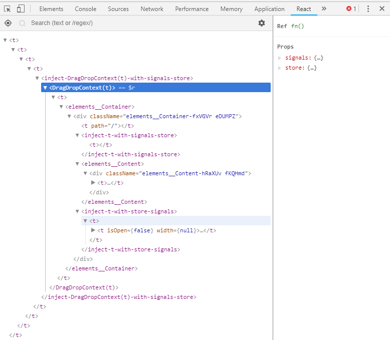

# 类属性

## defaultProps

  初化定一些默认的属性值。

  这非常有用，很好的避免有一些数据为`null`、`undefined`等异常。

  示例：

  ```jsx
    class CustomButton extends React.Component {
      // ...
    }

    CustomButton.defaultProps = {
      color: 'blue'
    };
  ```

## displayName

  组件显示的名称，一般在debugger的时候用到，所以可以不用设置它。

  React的debugger:

  需要安装[React Developer Tools](https://chrome.google.com/webstore/detail/fmkadmapgofadopljbjfkapdkoienihi)

  示例：

  