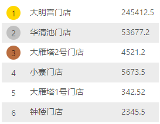

# React List 实现

  在实际项目应用中，我们常常会用到一些列表的展示，比如我们最常见到的表格列表、查询列表等。

  这种情况通常服务端API会返回一个List，我们需要遍历这个List将其实数据显示到界面上。

  首先看一个销售额排行的例子：

  

  [在线示例](https://codesandbox.io/s/mzzk5yj3kx)

  代码片段：
  
  ```jsx
  import React from 'react';
  import classNames from 'classnames';
  import './List.css';

  export default ({ list }) => {
    return (
      <div>
        {
          ((list || []).sort(t => t.turnover)).map((item, index) => {
            const clazz = classNames({
              gold: index === 0,
              silver: index === 1,
              copper: index === 2,
            })
            return (
              <li key={index} className='list'>
                <div><span className={clazz}>{index + 1}</span></div>
                <div>{item.store}</div>
                <div>{item.turnover}</div>
              </li>
            );
          })
        }
      </div>
    );
  }
  ```

  我们简化一下这段代码，将那些样式相关的代码去掉，只保留实现List的部分：

  ```jsx
  export default ({ list }) => {
    return (
      <div>
        {
          list.map((item, index) => {
            return (
              <li key={index}>
                <div><span>{index + 1}</span></div>
                <div>{item.store}</div>
                <div>{item.turnover}</div>
              </li>
            );
          })
        }
      </div>
    );
  }
  ```

  这是一个完整的React 组件，stateless形式的。

  参数`list`是一个数组，内容为门店销售对象。

  然后在`return`的`div` `html`片段中，直接写`js`逻辑，这与我们以前使用的模块语法大不相同。

  采用一对`{}`就可以将`js`代码嵌入到`html`片段中。

  而且在`js`代码中，又可以直接`return`一段`html`片段，本例中直接返回每一个门店对象的页面结构，也就是每一行的页面结构。

  这里需要注意的是：在任何循环返回的`html`片段中，必须指定`key`。如果是动态控制的，必须指定惟一的`key`,避免使用`index`.